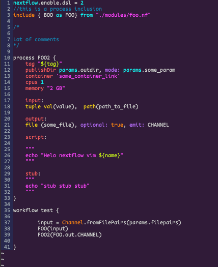

# Vim plugin for Nextflow workflows

Currently supports syntax highlighting of .nf scripts.

Extends (presumed-available) groovy syntax highlighting.

Image using [true](https://github.com/megantiu/true.vim) vim colorscheme by [megentiu](https://github.com/megantiu/) 

## Installation

### vim-plug

    Plug 'Mxrcon/nextflow-vim'

### Vundle

    Plugin 'Mxrcon/nextflow-vim'

### NeoBundle

    NeoBundle 'Mxrcon/nextflow-vim'

### Manual

    git clone https://github.com/Mxrcon/nextflow-vim ~/nextflow-vim;
    mkdir ~/.vim/ftdetect; mkdir ~/.vim/ftplugin;
    cp ~/nextflow-vim/ftdetect/nextflow.vim ~/.vim/ftdetect;
    cp ~/nextflow-vim/syntax/nextflow.vim ~/.vim/ftplugin;
